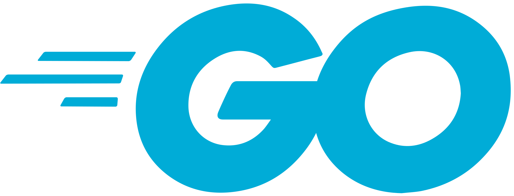
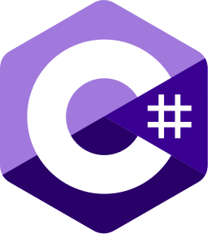
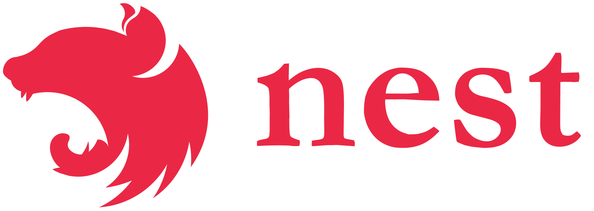

# DevTriangle

- **GO/NestJS Backend software engineer**

## Tech stack

      

            
            &nbsp;&nbsp;
            
            &nbsp;&nbsp;
            
            &nbsp;&nbsp;
            
            &nbsp;&nbsp;
            
      

      &nbsp;&nbsp;
      

            
            &nbsp;&nbsp;
            
            &nbsp;&nbsp;
            
      

      &nbsp;&nbsp;
      

            
            &nbsp;&nbsp;
            
      

